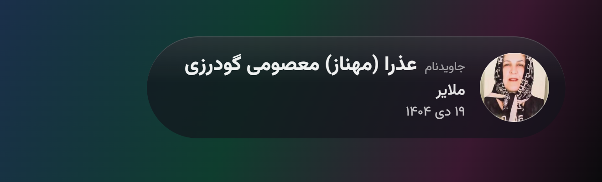
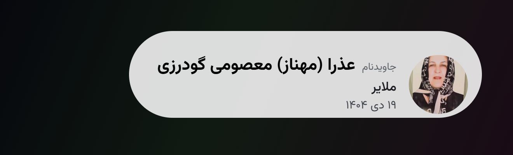
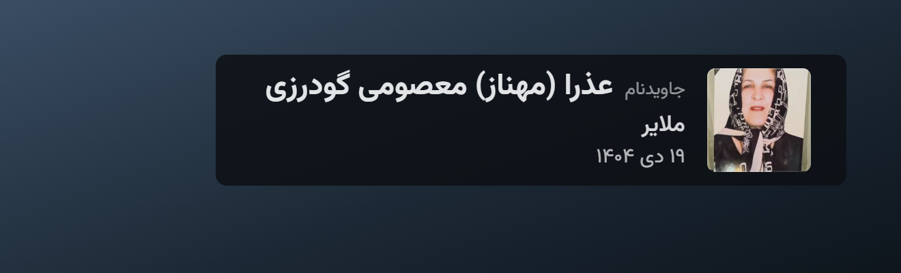

<div align="center">

# ویجت یادمان جاویدنامان

نام و عکس و سن و شهر **۳۱۷۵ جاویدنام** را، یکی‌یکی، گوشه‌ی استریم شما

**[ساخت آدرس با دکمه و پیش‌نمایش زنده ←](https://JavidNaman.github.io/stream-widget/builder/)**

</div>

---

## سه ظاهر

هر ظاهر آدرس جدای خودش را دارد و تنظیم‌های پیش‌فرضش هم فرق می‌کند.

### شیشه‌ای



```
https://JavidNaman.github.io/stream-widget/
```

کپسول تیره که تصویر پشتش کمی پیدا است. روی هر صحنه‌ای می‌نشیند و مشخصات با تار شدن عوض می‌شوند.

### سفید



```
https://JavidNaman.github.io/stream-widget/light/
```

کارت سفید تخت با نام مشکی و درشت. وقتی صحنه‌ی شما همیشه تاریک است، این یکی فوری به چشم می‌آید. مشخصات از پایین می‌لغزند و می‌آیند.

### زیرنویس



```
https://JavidNaman.github.io/stream-widget/subtitle/
```

نوار مات و بدون هیچ شفافیتی، با یک نوار رنگی در لبه. برای زیر تصویر استریم. کادر کامل بسته می‌شود، نفر بعد جایش می‌رود و دوباره باز می‌شود. رنگ نوار را با `accent` عوض کنید:

```
https://JavidNaman.github.io/stream-widget/subtitle/?accent=1e63d0
```

---

## راه‌اندازی در OBS

**۱.** در پنل **Sources** روی **+** بزنید و **Browser** را انتخاب کنید.

**۲.** یکی از سه آدرس بالا را در کادر **URL** بگذارید.

**۳.** اندازه را **۸۰۰ در ۳۰۰** بگذارید.

**۴.** تیک **Shutdown source when not visible** را بزنید تا وقتی صحنه فعال نیست چیزی مصرف نشود.

**۵.** **OK** بزنید و ویجت را هرجای تصویر که خواستید بگذارید.

پس‌زمینه‌ی ویجت شفاف است و روی هر صحنه‌ای می‌نشیند. کارت به گوشه‌ی بالا-راستِ کادر می‌چسبد و به‌اندازه‌ی نام هر نفر باز و بسته می‌شود.

**هر اندازه‌ای کار می‌کند.** ویجت خودش را با کادر جور می‌کند، پس هرچه کادر را بزرگ‌تر بگیرید تصویر بازتر و واضح‌تر می‌شود — چون واقعاً بزرگ‌تر رندر می‌شود، نه اینکه بعداً کش بیاید. برای بزرگ کردن زیاد در OBS، کادر را ۱۲۸۰ در ۴۸۰ بگذارید. اگر هم از قبل ۸۰۰ در ۳۰۰ گذاشته بودید، همان درست کار می‌کند و لازم نیست دست بزنید.

پیش از هر نام، واژه‌ی **جاویدنام** با قلمی کوچک‌تر می‌آید. هیچ نامی با سه‌نقطه بریده نمی‌شود؛ اگر نامی جا نشود اندازه‌اش یکی-دو پله کم می‌شود.

---

## تنظیم‌ها

ساده‌ترین راه، [صفحه‌ی ساخت آدرس](https://JavidNaman.github.io/stream-widget/builder/) است: دکمه بزنید، همان‌جا ببینید، آدرس را کپی کنید.

اگر دستی می‌نویسید، تنظیم‌ها با `?` شروع و با `&` به هم وصل می‌شوند:

| تنظیم | پیش‌فرض | چه‌کار می‌کند |
| --- | --- | --- |
| `duration` | `6000` | هر نفر چند میلی‌ثانیه روی صفحه بماند. در ظاهر زیرنویس `5000`. |
| `fade` | `380` | انتقال چند میلی‌ثانیه طول بکشد. در ظاهر زیرنویس `320`. |
| `anim` | بسته به ظاهر | نحوه‌ی عوض شدن: `blur` و `fade` و `slide` و `wipe` و `none`. |
| `scale` | خودکار | بزرگ‌نمایی دستی. اگر ننویسید، ویجت خودش را با کادر جور می‌کند. |
| `glass` | `0.72` | غلظت شیشه. عدد کم‌تر یعنی تصویر پشتش بیشتر پیدا است. روی ظاهر زیرنویس اثری ندارد. |
| `accent` | `b3282d` | رنگ نوار کناری ظاهر زیرنویس، به‌صورت کد رنگ. |
| `order` | `random` | ترتیب نمایش. با `list` فهرست به‌ترتیب اصلی جلو می‌رود. |

نمونه — زیرنویس آبی و آرام:

```
https://JavidNaman.github.io/stream-widget/subtitle/?accent=1e63d0&duration=9000
```

---

## داده‌ها

فهرست از [یادمان جاویدنامان ایران‌اینترنشنال](https://javidnaman.iranintl.com/memorial) گرفته شده و در [`data.json`](data.json) نگهداری می‌شود. هر نفر یک خط است:

```json
{"id":"...","name":"نام کامل","age":28,"place":"تهران","date":"۱۹ دی ۱۴۰۴","photo":true}
```

| فیلد | توضیح |
| --- | --- |
| `id` | شناسه‌ی هر نفر، که نام فایل عکسش در `images/` هم هست |
| `name` | نام کامل |
| `age` | سن، یا `null` اگر معلوم نیست |
| `place` | شهر یا محل، یا `null` |
| `date` | تاریخ شمسی، یا `null` |
| `photo` | اگر `false` باشد، کارت بدون عکس و جمع‌تر نمایش داده می‌شود |

هر فیلدی که `null` باشد، آن خط از کارت حذف می‌شود و بقیه‌ی کارت به‌هم نمی‌ریزد.

از این ۳۱۷۵ نفر، ۲۹۶۰ نفر عکس دارند، ۲۵۰۵ نفر سن، ۳۱۵۳ نفر محل و ۲۹۱۴ نفر تاریخ.

---

## مشارکت

اگر نامی جا افتاده یا اطلاعاتی اشتباه است، Issue باز کنید یا مستقیم Pull Request بفرستید.

**برای اصلاح یک نفر:** فایل [`data.json`](data.json) را باز کنید، خط آن شخص را پیدا و ویرایش کنید. هر نفر یک خط جداست تا تغییرات به‌سادگی قابل بررسی باشد.

**برای اضافه کردن یک نفر:** یک خط تازه با همان ساختار بالا بنویسید. اگر عکس دارید، آن را با نام `<id>.jpg` در پوشه‌ی `images/` بگذارید و `photo` را `true` کنید؛ اگر ندارید `photo` را `false` بگذارید.
